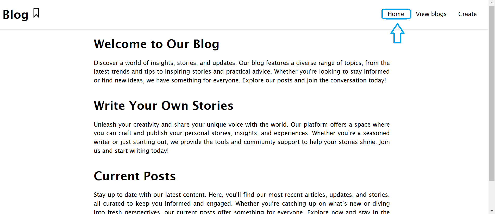
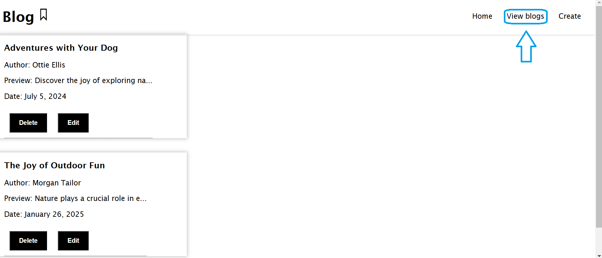
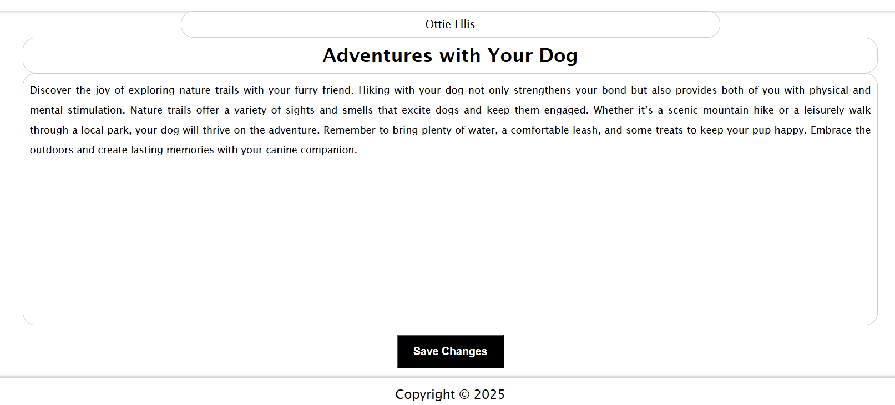
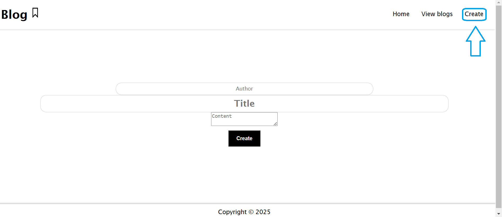

# Blog-Web-Application

- The goal of this project was to create a Blog web application using Node.js, Express.js, and EJS. The application allows users to create and view blog posts. Posts do not persist between sessions as no database will is used in this version of the application. Styling is an important aspect of this project to ensure a good user experience.
---

## *Features*

- *Blog Post Management*: Create, update, delete, and view blog posts.
- *Responsive Design*: Works seamlessly on desktops, tablets, and mobile devices.


---

## *Technologies Used*

- *Node.js*: JavaScript runtime used to build the server-side logic.
- *Express.js*: Web framework for Node.js, used to create the server, handle HTTP requests, define routes, and manage middleware.
- *EJS*: Templating engine for rendering dynamic HTML content.

---

## *Screenshots*


---

If you want to view the blog you can just hover over it with the mouse and then click.
If you want to edit the already existing post you can just click "Edit" tag. Or if you just want to delete a blog, click on that button.




This opens when you click "Create" from the toolbar.




---

## *Installation*

To run this project locally, you'll need Node.js and npm (Node Package Manager) installed. Follow the steps below to set up the project on your local machine:

1. Clone the repository:
   ```bash
   git clone https://github.com/your-username/blog-web-application.git
   ```
2.	Navigate to the project directory:
   ```bash
     cd blog-web-application
   ```
3.	Install all dependencies:
   ```bash
      npm install
  ```
   
---

## *Usage*
After installing the project, start the application with the following command:
```bash
node index.js
```
The application is available at http://localhost:3000.

Let me know if you'd like me to customize it further!
